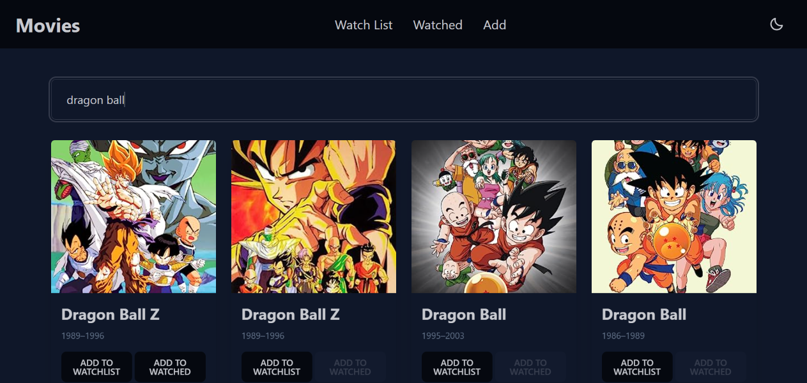

# Movie Watchlist App

[Live Site](https://waseemazmy21.github.io/movie-watchlist-app/)

## Technologies and Tools

- React: Building dynamic user interfaces.
- Vite: Swift development and efficient build tool.
- Tailwind CSS: Stylish and responsive design.
- Open Movie Database (OMDb) API: Fetching real-time movie data.

## Usage

To get started, follow these steps:

1. Clone the repository: `git clone https://github.com/yourusername/movie-watchlist-app.git`
2. Install dependencies: `npm install`
3. Run the development server: `npm run dev`
4. Open your browser and navigate to `http://localhost:3000`

For production:

1. Build the project: `npm run build`
2. Preview the production build: `npm run preview`
